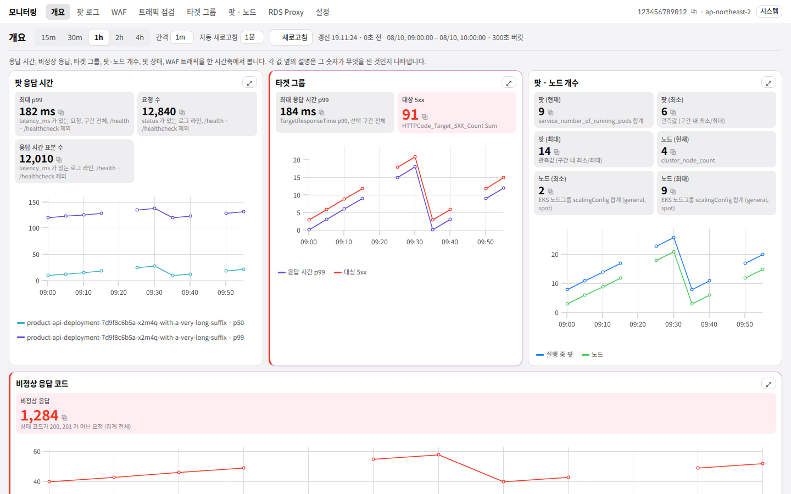

# skills-dashboard

> 2026년 전국기능경기대회 3과제에 사용할 목적으로 만든 대시보드입니다.

EKS 워크로드를 로컬에서 관찰하는 대시보드입니다. 팟 로그, WAF 로그, 타겟 그룹 지표, 팟·노드 리소스와 개수, 팟 상태, RDS Proxy 커넥션을 **하나의 시간축** 위에 모읍니다.

데이터는 전부 **AWS CloudWatch** 에서 옵니다. Kubernetes API에도 Prometheus에도 접근하지 않으며, 액세스 키 하나로 동작합니다. 예외는 하나, 트래픽 점검 화면뿐입니다.



## 화면

| 화면 | 답하는 질문 |
| --- | --- |
| [개요](docs/screenshots/overview.png) | 지금 이 클러스터는 괜찮은가 — 응답 시간·비정상 응답·타겟 그룹·팟 개수·WAF 를 한 화면에 |
| [팟 로그](docs/screenshots/pod-logs.png) | 어느 앱이 느리고 어느 경로가 실패하는가 |
| [WAF](docs/screenshots/waf.png) | 무엇이 들어왔고 무엇이 막혔는가 — 경로·메소드·헤더를 action 단위로 |
| [트래픽 점검](docs/screenshots/check.png) | **지금** 응답하는가 — 대시보드가 직접 GET 을 한 번 보낸다 |
| [타겟 그룹](docs/screenshots/targetgroup.png) | ALB 가 보는 응답 시간과 5xx |
| [팟·노드](docs/screenshots/kubernetes.png) | CPU·메모리와 개수, 팟 상태 |
| [RDS Proxy](docs/screenshots/database.png) | 커넥션이 포화됐는가 |
| [설정](docs/screenshots/settings.png) | 무엇을 모니터링할지, 로그를 어떻게 파싱할지 |

화면마다의 규칙과 알려진 한계는 [`docs/behavior.md`](docs/behavior.md) 에 있습니다.

## 실행

```bash
mise install                                    # go 1.26.5 + node 24
npm run install:server && mise run node:build   # node 엔진
mise run build                                  # Go 엔진 → bin/
cp .env.example .env                            # 액세스 키
node start.mjs                                  # http://127.0.0.1:8080
```

`npm start` 도 같습니다. 인자를 줄 때는 `npm start -- --port 9000` 처럼 `--` 를 끼웁니다.

| 플래그 | 기본값 | 뜻 |
| --- | --- | --- |
| `--port` | `8080` | 명시하지 않으면 8080..8085 중 빈 포트를 씁니다. 실제 포트는 로그의 `dashboard is listening` 줄에 있습니다 |
| `--addr` | `127.0.0.1` | 바인드 주소 |
| `--open` | `true` | `--open=false` 로 끕니다. `=` 가 필수입니다 |
| `--verbose` | `false` | debug 로그 |
| `--env` | — | 다른 `.env` 를 쓸 때. 준 경로가 없으면 실행이 실패합니다 |

### 액세스 키

두 곳에서 읽고, **설정 화면에서 저장한 키가 `.env` 를 이깁니다.**

설정 화면에 키를 넣고 저장하면 AWS 에 한 번 물어본 뒤 통과할 때만 `~/.skills-dashboard/credentials.json`(0600)에 기록하고, 재시작 없이 적용됩니다. `저장된 키 지우기` 로 `.env` 로 되돌아갑니다. 지금 어느 쪽으로 돌고 있는지는 설정 화면의 자격증명 카드가 말합니다.

엔진은 `.env` 를 **실행 파일과 같은 폴더**에서 먼저, 없으면 `~/.skills-dashboard/` 에서 찾습니다. 현재 작업 디렉터리는 보지 않습니다 — 어디서 실행했느냐로 읽는 키가 달라지지 않게 하기 위해서입니다. `start.mjs` 가 `--env <저장소 루트>/.env` 를 대신 넘겨 주므로, 런처로 실행하는 한 `.env` 는 저장소 루트에 두면 됩니다.

`.env` 도 `credentials.json` 도 clone 에 딸려 오지 않습니다.

## 엔진이 둘입니다

같은 대시보드를 띄우는 백엔드가 두 벌이고, `start.mjs` 가 무엇을 띄울지 고릅니다.

| 엔진 | 실체 | 비고 |
| --- | --- | --- |
| `node` | `server/dist/skills-dashboard.mjs` | TypeScript 백엔드를 esbuild 로 묶은 파일 하나. **대회 당일 실제로 돌린 것** |
| `binary` | `bin/skills-dashboard-<플랫폼>` | Go 백엔드. 6,900줄의 Go 테스트가 지키고 있습니다 |

```bash
node start.mjs                                  # 번들이 있으면 node, 없으면 binary
SKILLS_DASHBOARD_ENGINE=binary node start.mjs   # 실행 파일로 고정
SKILLS_DASHBOARD_ENGINE=node   node start.mjs   # 번들로 고정
```

두 번째 엔진이 있는 이유는 하나입니다. **대회장에서 실행이 허용된 목록에 Go 가 없었고, node 는 있었습니다.**

Go 툴체인도 없었으므로 Go 쪽은 실행 파일을 미리 만들어 커밋해 가져가는 수밖에 없었는데, 그렇게 가져간 exe 를 현장에서 띄울 수 있다는 보장이 없었고 막히면 되돌릴 방법도 없었습니다. clone 안의 실행 파일 하나에 전부를 걸고 있었던 셈입니다. 그래서 백엔드 8,000줄을 TypeScript 로 이식해 **허용된 런타임 위에서 도는** 두 번째 트랙을 만들었고, 대회 당일 실제로 돌린 것은 이쪽입니다. 당시의 판단은 [`NOTES.md`](NOTES.md) 의 2026-08-24 두 항목에 있습니다.

로직이 두 벌이라 갈라질 수 있으므로 `mise run parity` 가 두 엔진을 각각 띄우고 같은 요청을 던져 응답을 **바이트 단위로** 비교합니다. 한쪽만 고치면 여기서 걸립니다.

```
일치 35 · 미구현 0 · 불일치 0
```

대회 당일 돌린 바이너리와 번들은 커밋되어 있었고, 지금은 히스토리에만 남아 있습니다.

```bash
git show 8eef79f:bin/skills-dashboard-linux-x64 > skills-dashboard   # 12,939,426 바이트
git show 8eef79f:server/dist/skills-dashboard.mjs > bundle.mjs
```

이 둘은 서드파티 고지가 갖춰지기 전의 산출물입니다. 꺼내서 남에게 넘길 일이 있다면
[`THIRD_PARTY_NOTICES.md`](THIRD_PARTY_NOTICES.md) 와 [`LICENSE`](LICENSE) 를 함께 넘기세요.

## 설계

이 저장소는 재작성입니다. 이전 구현이 겪은 세 가지 문제가 아키텍처를 결정했습니다. 각각의 맥락과 기각된 대안은 [`NOTES.md`](NOTES.md) 의 결정 로그에 있습니다.

- **로그가 쌓여도 느려지지 않는다.** 로컬 SQLite 적재를 버리고 집계를 CloudWatch Logs Insights 로 내렸습니다. 로컬에 누적되는 상태가 없으므로 시간이 지나도 비용이 일정합니다. 대가는 스캔 바이트당 과금이고, 그래서 **각 패널이 스캔량을 표시합니다.**
- **오버뷰와 상세가 같은 값을 낸다.** 화면에 뜨는 모든 숫자는 백엔드 `stats` 에서 오고 프론트는 포맷팅만 합니다. `table.total` 은 `rows` 와 독립적으로 계산되어 목록이 잘려도 건수는 잘리지 않고, 각 `stat` 은 `basis` 로 무엇을 센 것인지 밝힙니다.
- **오래 켜둬도 죽지 않는다.** `ListMetrics` 를 `SEARCH()` 수식으로 대체해 쿼리 수 상한 초과를 구조적으로 없앴고, 쿼리별 데드라인·동시 실행 세마포어·single-flight 캐시·핸들러 패닉 격리를 넣었습니다.

## 개발

툴체인은 mise 가 관리합니다. 패키지 매니저는 npm 하나입니다.

```bash
mise install            # go 1.26.5 + node 24
npm run install:web     # web/node_modules
npm run install:server  # server/node_modules (esbuild · aws-sdk · hono)
mise run test           # go test ./... + vitest
mise run test:e2e       # playwright 레이아웃 검증
mise run lint           # go vet + prettier + eslint
mise run build          # bin/skills-dashboard-{win32-x64.exe,linux-x64}
mise run node:build     # server/dist/skills-dashboard.mjs
mise run parity         # 두 엔진의 응답을 엔드포인트마다 대조
mise run licenses       # THIRD_PARTY_NOTICES.md 재생성 (두 엔진을 먼저 빌드)
npm run dev             # :5173 (UI) + :8080 (API), /api 를 프록시
```

`bin/` 과 `server/dist/` 는 빌드 산출물이며 커밋하지 않습니다. SPA 는 한 번만 빌드해 두 엔진이 나눠 씁니다 — `mise run web:build` 가 `internal/web/dist` 에 쓰고, Go 는 그것을 `//go:embed` 로, node 는 번들 시점에 base64 로 인라인합니다.

### 구조

```
start.mjs                 런처 — 엔진을 고르고 띄운다. 의존성 없음
scripts/launcher.mjs      엔진 선택과 .env 전달. start.mjs 와 dev.mjs 가 공유
scripts/parity.mjs        두 엔진의 응답 대조

cmd/skills-dashboard/     진입점, http.Server
internal/domain/          순수 로직 — 윈도, 쿼리 빌더, 응답 계약, 메트릭 카탈로그
internal/awsx/            AWS 호출 — 인터페이스 경계, SEARCH 기반 메트릭, Insights 러너, 캐시
internal/config/          자격증명(.env·저장된 키), 리소스 선택 저장
internal/api/             HTTP 핸들러와 패널 빌더
internal/web/             embed.FS + SPA 폴백

server/src/domain/        internal/domain 의 이식
server/src/aws/           internal/awsx 의 이식
server/src/config/        internal/config 의 이식
server/src/http/          internal/api 의 이식
server/src/contract.ts    web/src/lib/types.ts 를 서버 타입으로 재사용

web/                      SvelteKit (SSR 없음), uPlot + layerchart
```

`internal/awsx/iface.go` 의 좁은 인터페이스가 테스트 경계입니다. 모든 AWS 호출이 여기를 지나므로 실제 AWS 없이 전 경로를 검증할 수 있습니다.

node 쪽에는 그에 해당하는 단위 테스트가 없습니다. 대신 `web/src/lib/types.ts` 를 그대로 구현 타입으로 쓰므로 와이어 계약 위반은 컴파일에서 걸리고, 나머지는 `mise run parity` 가 봅니다.

## 문서

| 파일 | 내용 |
| --- | --- |
| [`docs/behavior.md`](docs/behavior.md) | 무엇을 어떻게 세는가 — 조회 기간, WAF, 트래픽 점검, 로그 형식, 리전, 알려진 한계 |
| [`NOTES.md`](NOTES.md) | 왜 그렇게 만들었는가 — 날짜별 결정 로그(맥락·채택·기각·대가·검증) |
| [`web/README.md`](web/README.md) | 프론트엔드 |

`docs/screenshots/` 의 그림은 e2e 픽스처로 찍은 것이라 AWS 계정이 필요 없습니다. 다시 찍으려면 `SHOTS=1 npm --prefix web run test:e2e -- shots` — 리눅스에서는 폰트를 먼저 잡아야 합니다(`web/e2e/shots.e2e.ts` 주석 참고).

## License

This project is licensed under the [BSD 3-Clause License](LICENSE).

Third-party components bundled into the build artifacts are listed in
[THIRD_PARTY_NOTICES.md](THIRD_PARTY_NOTICES.md).
