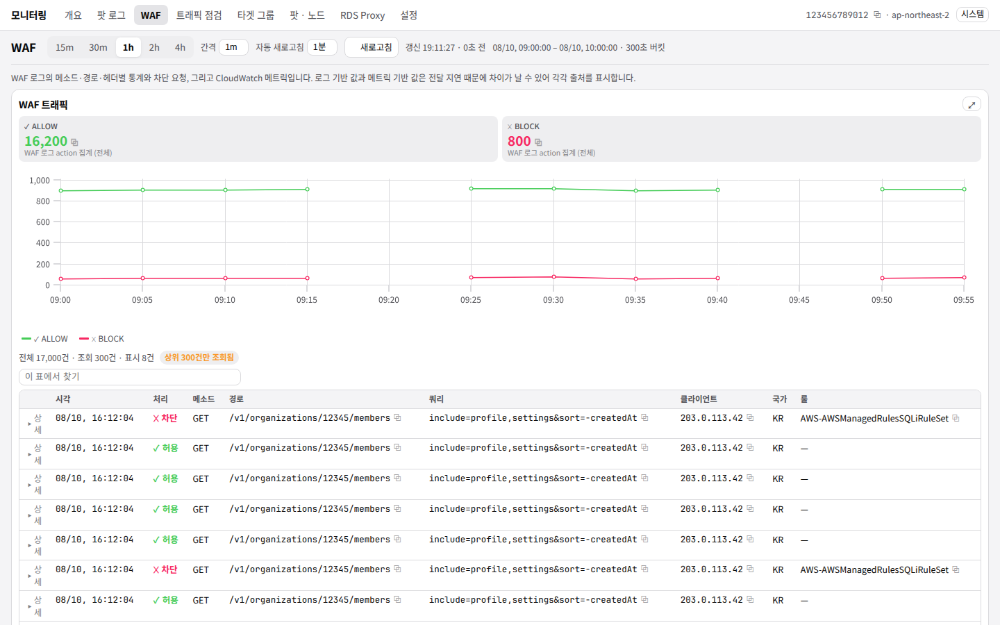
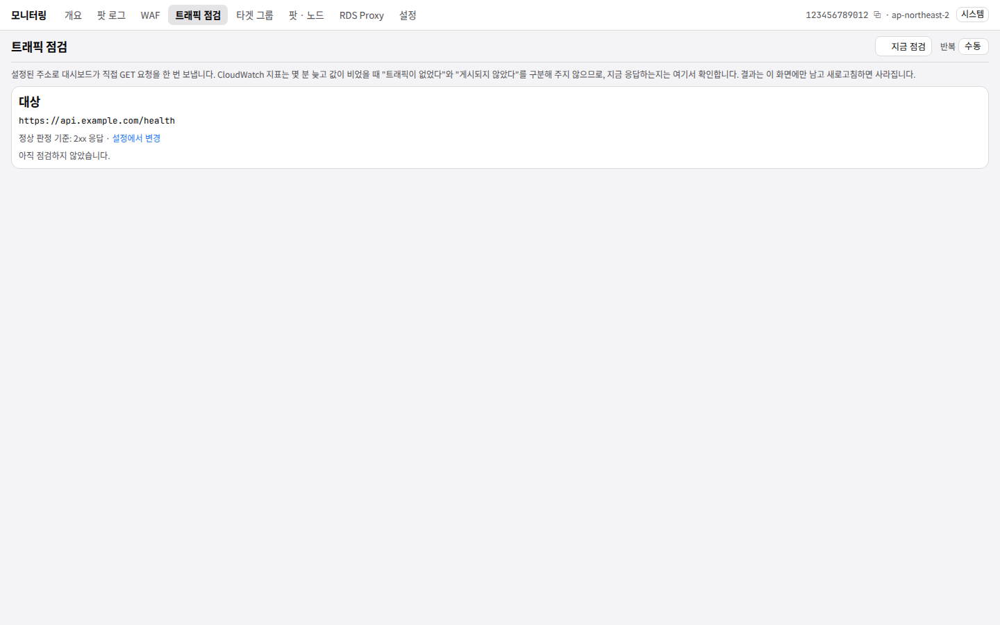

# 동작

[`README`](../README.md) 는 이 대시보드가 무엇이고 어떻게 띄우는지를 적습니다.
이 문서는 **무엇을 어떻게 세는지** — 화면마다의 규칙과 그 규칙이 만드는 한계를 적습니다.
왜 그렇게 정했는지는 [`NOTES.md`](../NOTES.md) 의 결정 로그에 있습니다.

---

## 조회 기간

**최대 4시간**입니다. 15m / 30m / 1h / 2h / 4h 중에서 고르고, 간격은 1m / 5m / 10m / 1h 중 버킷 수가 4~250개가 되는 조합만 열립니다. 서버가 검증하고, UI도 유효한 조합만 제시합니다.

윈도의 끝은 간격 경계로 내림되므로 **모든 버킷이 완전한 버킷**입니다. 진행 중인 미완성 버킷은 들어오지 않습니다.

---

## WAF 화면




WAF 로그는 **action 단위로** 읽습니다. "이 경로에 4,000건"은 그중 몇 건이 애플리케이션에 도달했는지 말해 주지 않으므로, 경로·메소드·헤더 통계는 전부 허용 / 차단 / 기타와 **마지막 처리**를 함께 보여줍니다. 집계 자체가 action 별로 나뉘어 오고, 표는 그것을 키 하나로 접어 보여줄 뿐입니다 — 스캔 횟수는 늘지 않습니다.

`WAF 트래픽` 패널에는 개별 요청 목록이 붙습니다. 차단된 요청만 나열하면 빈 목록이 "아무것도 차단되지 않았다"인지 "아무것도 들어오지 않았다"인지 구분되지 않기 때문에, 이 목록은 action 으로 거르지 않습니다. 목록은 상한에서 잘리지만 **옆의 건수는 잘리지 않습니다** — 그 숫자는 목록이 아니라 action 시계열 합계에서 옵니다.

## 트래픽 점검




`트래픽 점검` 화면은 설정된 주소로 대시보드가 **직접 GET 요청을 한 번** 보내고 상태 코드와 소요 시간을 보여줍니다. 나머지 화면이 읽는 CloudWatch 지표는 몇 분 늦고, 값이 비었을 때 "트래픽이 없었다"와 "게시되지 않았다"를 구분해 주지 않습니다. 지금 응답하는지는 물어봐야 알 수 있습니다.

경계는 좁게 잡혀 있습니다.

- **누를 때만 나갑니다.** 상단 바에 상태 배지를 두지 않은 이유가 이것입니다 — 배지는 매 페이지 로드마다 요청을 쏘게 되고, 그건 아무도 요청하지 않은 트래픽입니다. 화면 안의 반복 주기는 기본 꺼짐입니다.
- 주소는 `http` / `https` 만 허용하며, 설정 저장 시 거부하고 로드 시에는 그 값만 비웁니다. 다른 설정값과 같은 규칙입니다.
- 응답 **본문은 읽고 버립니다.** 저장하지도 표시하지도 않습니다.
- 결과 이력은 메모리에만 최근 20회 남습니다. 새로고침하면 사라집니다. 보존하기 시작하면 이건 버튼이 아니라 모니터링 시스템이 됩니다.

정상 판정 기준은 기본이 2xx이고, 인증이 걸려 401이 정상인 엔드포인트처럼 특정 코드 하나만 정상으로 봐야 하는 경우 설정에서 그 코드를 지정합니다. 화면은 무엇과 비교했는지를 결과 옆에 함께 표시합니다.

## 패널 확대

각 패널의 제목 옆 버튼이 같은 패널을 크게 엽니다. 네이티브 `<dialog>` 의 `showModal()` 이라 ESC와 배경 클릭으로 닫히고, 여는 동안 배경은 비활성화됩니다.

카드와 모달은 **같은 스니펫 하나**를 렌더하며 인자는 차트 높이뿐입니다. 이전 구현은 그리드에서 막대 8개, 확대 다이얼로그에서 30개를 보여 주고 막대 눈금을 화면에 있는 것에서 계산했기 때문에 같은 패널이 두 곳에서 다르게 읽혔습니다. 코드 경로가 하나뿐이면 그 일이 일어날 자리가 없습니다.

열려 있는 동안 자동 새로고침은 **그대로 돕니다.** 갱신을 멈추는 모달은 낡은 숫자를 낡았다는 말 없이 읽게 하는 모달입니다.

## 리전과 모니터링 대상

리전은 두 개입니다. 작업 리전은 자격증명의 `AWS_REGION` 이, WAF 리전은 `~/.skills-dashboard/config.json` 의 `wafRegion`(기본 `us-east-1`)이 정합니다.

작업 리전은 설정 화면에서 키와 함께 바꿀 수 있고, 저장하면 재시작 없이 반영됩니다. WAF 리전은 아직 `config.json` 을 직접 고친 뒤 재시작해야 합니다.

### WAF 로그 그룹은 버지니아에 있습니다

CLOUDFRONT 스코프 웹 ACL은 배포가 어디서 트래픽을 받든 **us-east-1 에만** 로그와 메트릭을 남깁니다. 그래서 WAF 패널의 Logs Insights 쿼리와 로그 그룹 자동 조회는 작업 리전이 아니라 WAF 리전 클라이언트를 씁니다. 설정 화면의 WAF `자동 조회` 도 그 리전의 `aws-waf-logs-*` 그룹만 보여 줍니다.

### 설정 파일이 잘못돼도 시작은 합니다

설정은 `~/.skills-dashboard/config.json` 에 저장됩니다. 이 파일 **내용** 때문에 실행이 막히는 일은 없습니다.

- 저장된 값 중 지금 규칙으로 쓸 수 없는 것(예전 버전이 받아준 로드 밸런서 이름 등)은 **그 값만 비우고** 나머지 설정으로 뜹니다. 무엇을 왜 비웠는지는 로그와 설정 화면 상단에 뜹니다.
- JSON 자체가 깨져 읽히지 않으면 기본값으로 시작하고, 원본은 `config.json.bak` 으로 옮겨 둡니다.
- 반대로 **설정 화면에서의 저장은 엄격합니다.** 잘못된 값은 이유와 함께 거절합니다 — 사람이 보고 있는 순간이라 거절이 곧 피드백이고, 방금 입력한 값을 조용히 버리는 편이 더 나쁩니다.

기본 포트 8080이 사용 중이면 8081부터 차례로 잡고 어느 포트로 떴는지 로그에 남깁니다. `--port` 로 직접 지정한 경우에는 그 포트를 존중하고, 열 수 없으면 이유를 말하고 종료합니다. 탐색기에서 더블클릭해 띄운 경우에는 종료 전에 이유를 띄우고 엔터를 기다리므로 창이 그냥 사라지지 않습니다.

### 로드 밸런서는 ARN이 아니라 차원 값입니다

`loadBalancer` 에 들어가는 값은 CloudWatch 의 `LoadBalancer` 차원, 즉 ARN 의 뒤쪽 경로입니다.

```
arn:aws:elasticloadbalancing:ap-northeast-2:123:loadbalancer/app/my-alb/50dc6c495c0c9188
                                                             └──────── 이 부분 ────────┘
```

`자동 조회` 로 고르면 이 형태로 채워지고, 전체 ARN을 붙여넣어도 저장할 때 변환합니다. 변환으로도 살릴 수 없는 값(로드 밸런서 **이름**만 넣는 등)은 저장이 거부됩니다 — 메트릭 SEARCH 는 `:` 와 `/` 를 허용하므로 잘못된 값도 통과한 뒤 아무것도 매칭하지 않고, 그러면 "트래픽이 없는 로드 밸런서" 와 구분되지 않는 빈 차트가 나오기 때문입니다.

---

## 로그 형식

Container Insights / fluent-bit 봉투를 읽습니다.
기본 preset은 JSON과 Gin access log를 자동으로 구분합니다.

JSON 라인은 `log_processed`의 파싱 결과를 먼저 씁니다.
Gin 라인은 아래 기본 형식을 읽습니다.

```text
[GIN] 2026/08/21 - 11:00:00 | 200 | 1.25ms | 10.0.4.18 | GET "/v1/user?id=7"
```

Gin의 `ns`, `µs`, `ms`, `s`, `m`, `h`를 모두 `ms`로 변환합니다.
앱 이름은 `kubernetes.container_name`에서 가져옵니다.
따라서 `user`, `stress`, `product`를 따로 집계합니다.

요청 목록에는 query string을 포함한 대상을 표시합니다.
경로 집계와 제외 규칙에는 query string을 뺀 path를 씁니다.

설정 화면에서 `자동 인식`, `Gin`, `JSON`을 고를 수 있습니다.
이전 버전의 로그 파싱 규칙은 처음 읽을 때 폐기합니다.
AWS 리소스 선택과 조회 제한은 그대로 보존합니다.

필드명은 전부 설정값입니다. 설정 화면에 **실제 로그 한 줄을 붙여넣어 파싱 결과를 미리 확인**한 뒤 저장할 수 있습니다. 필드명이 틀렸을 때 패널이 조용히 비는 대신 그 자리에서 드러납니다.

팟 로그 화면에서 namespace 범위를 바꿀 수 있습니다.
설정값, 전체 namespace, 직접 입력 중 하나를 선택합니다.
선택값은 URL에 남으므로 같은 범위로 다시 열 수 있습니다.

### 헬스체크 제외

`/health`, `/healthcheck` 로 들어오는 요청은 기본으로 팟 로그 집계에서 제외됩니다. 몇 초마다 도는 프로브는 보통 요청 라인의 최대 공급원이고, 아무 일도 하지 않는 경로 쪽으로 응답 시간 백분위를 끌어내립니다. 프로브가 실패하기 시작하면 같은 행 수천 개가 비정상 응답 표를 채워 진짜 장애를 조회 상한 밖으로 밀어냅니다.

제외는 **집계 전에** 적용합니다.
응답 시간과 요청 수, 비정상 응답 건수에서 모두 빠집니다.
각 값의 설명에는 `/health · /healthcheck 제외`를 표시합니다.

Logs Insights는 선택한 시간 범위의 로그를 기준으로 과금합니다.
일반 `filter`만으로 스캔량이 줄어들지는 않습니다.

경로는 설정에서 바꿀 수 있습니다. **정확히 일치**하는 경로만 제외되며(접두어 규칙은 `/healthy-users` 같은 걸 함께 삼킵니다), 목록을 비우면 아무것도 제외하지 않습니다.

---

## 알려진 한계

- **팟의 최소·최대 개수**는 AWS API만으로 얻을 수 없습니다. CloudWatch는 HPA의 설정값을 게시하지 않으므로 조회 구간 내 **관측값**을 쓰며, UI가 그렇게 명시합니다. 노드의 최소·최대는 EKS 노드그룹 `scalingConfig`에서 가져오며 매 요청마다 갱신합니다.
- **팟 상태 패널은 확장 관찰성을 요구합니다.** `pod_status_running` / `pod_status_pending` / `pod_status_failed` 는 Container Insights **확장 관찰성**(`amazon-cloudwatch-observability` 애드온)에서만 게시됩니다. 구버전 에이전트를 쓰는 클러스터에서는 이 셋이 비고 컨테이너 재시작만 남으며, 패널이 그 이유를 경고로 띄웁니다.
- **OOMKilled 지표는 읽지 않습니다.** 확장 관찰성에는 `pod_container_status_terminated_reason_oom_killed` 가 있지만 사건이 일어난 뒤에만 나타납니다. CrashLoop은 컨테이너 재시작 증가로, OOM은 팟 로그의 `OOMKilled` 패턴으로 보완하며 완전하지 않음을 UI에 표시합니다.
- **Container Insights가 꺼져 있으면** 팟·노드 관련 패널이 빕니다. 그럴 때는 빈 화면 대신 안내를 띄웁니다.
- **WAF 로그 기반 값과 CloudWatch 메트릭 값은 정확히 일치하지 않습니다.** 로그 전달이 메트릭보다 몇 분 늦기 때문이며, 각 값이 자신의 출처를 표시합니다.
- **웹 ACL 선택은 스코프를 기억하지 않습니다.** 설정에는 ACL 이름만 저장되므로, WAF 리전이 작업 리전과 다를 때 WAF 메트릭 패널은 선택된 ACL을 전부 WAF 리전에서 읽습니다. REGIONAL 스코프 ACL은 작업 리전에 메트릭을 게시하므로 두 스코프를 섞어 고르면 REGIONAL 쪽이 빕니다. 한쪽 스코프만 쓰는 경우에는 문제가 없습니다.

아래는 대회 종료 시점에 **확인하지 못한 채로 남은 것**들입니다. 아카이브이므로 고치지 않고 적어만 둡니다.

- **실계정 검증은 팟 로그 패널까지만 했습니다.** ap-northeast-2 에서 두 엔진 각각으로 확인했습니다. WAF 패널과 메트릭 패널은 목킹과 픽스처로만 검증했고, WAF 브레이크다운의 `max(@timestamp) as lastTs` 는 AWS 문서상 지원되는 stats 함수지만 실제 로그 그룹에서 실행해 보지 않았습니다.
- **팟 애플리케이션 로그의 최종 형식이 확정되지 않았습니다.** 현재 필드 매핑은 참고 구현의 실제 샘플에서 역산한 기본값입니다. 설정 화면의 "샘플 붙여넣기 → 파싱 미리보기" 로 확인한 뒤 조정하는 것을 전제로 두었습니다.
- **`queryTimeoutSeconds` 변경이 재시작 전까지 반영되지 않습니다.** `InsightsRunner` 의 `Timeout` 과 `Concurrency` 가 `once.Do` 안에서 굳습니다.
